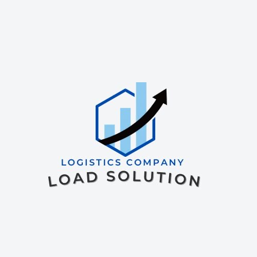
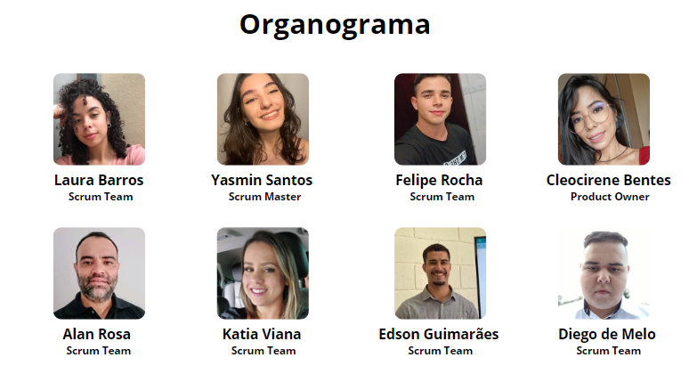
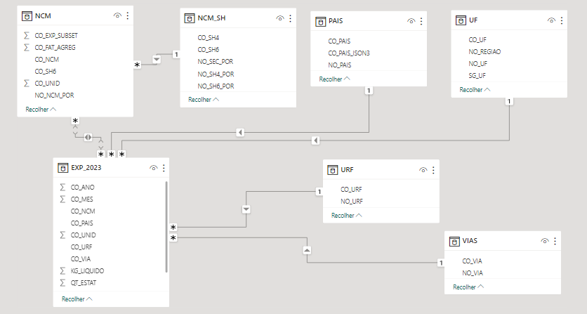
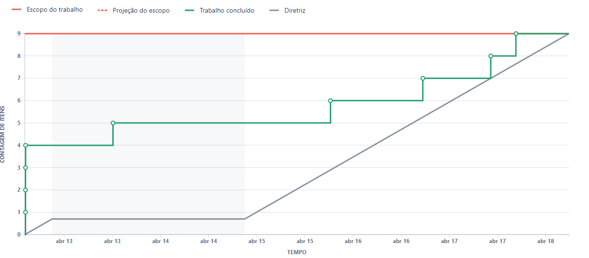

# Projeto Integrador (API) 2° Semestre 

# Índice

* [Projeto](#projeto-template)
* [Empresa](#Empresa)
* [Equipe](#equipe)
* [Objetivo do Projeto](#objetivo-do-projeto)
* [Cronograma das Sprints](#Cronograma-das-Sprints)
* [Regras de Negócio](#Regras-de-Negócio)
* [Tecnologias Específicas](#Tecnologias-Específicas)
* [Backlog do Produto](#Backlog-do-produto)
* [Produto](#Produto)

# Projeto (API) 

Geografia do fluxo de exportação de carga e previões de movimentações futuras.

# Empresa

> Logo

      

> Missão

Facilitar o comércio global através de soluções logísticas inovadoras e eficiente, implusionando o crescimento sustentável de nossos clientes, parceiros e comunidades. 

> Visão

Ser destaque em parcerias de exportação, reconhecida pela excelência operacional, integridade e compromisso com a satisfação do cliente em todos os continentes. 

> Valores

      

> Estrutura Organizacional 

 

      

# Equipe

|    Função     | Nome                                  |                                                                                                                                                      LinkedIn & GitHub                                                                                                                                                      |
| :-----------: | :------------------------------------ | :-------------------------------------------------------------------------------------------------------------------------------------------------------------------------------------------------------------------------------------------------------------------------------------------------------------------------: |
| Product Owner | Cleocirene Fonseca |                 |
| Scrum Master  | Yasmin Isabele F. G Dos Santos |            |
| Team Scrum   | Felipe Rocha  Macedo      |                  |
|  Team Scrum  | Katia Patrícia Viana                |                  |
|  Team Scrum  | Alan Marcelo da Silva Rosa          |       |
|  Team Scrum | Laura da Silva Barros       |                      |
|  Team Scrum  | Diego de Melo Silva      |                      |
|  Team Scrum  | Edson Silva Guimarães     |                      |

# Objetivo do Projeto

- Desenvolver um Dashboard que permita, identificar os modais utilizados na geografia de fluxos de exportação de cargas no estado de São Paulo e previsões de futuras movimentações de cargas. 

# Cronograma das Sprints 

Sprint | Previsão | Status| Histórico|
|------|--------|------|--------|
|Kick Off | 11/03/2024 | Concluído | [Ver Relatório](Kick-off.pptx) | 
|01| 18/04/2024 | Concluído | [Ver Relatório](API2/Relatório-Sprint1.pdf)| 
|02| 09/05/2024| Concluído |[Ver Relatório](API-Sprint2.docx) | 
|03| 30/05/2024| Não iniciado |[Ver Relatório]() | 
|04| 20/06/2024 | Não iniciado |[Ver Relatório]()  | 
|Feira de Soluções| 27/06/2024 | Não iniciado |[Ver Relatório]()  | 

# Regras de Negócio 

> Requisitos Funcionais

* Estrutura de Base de Dados 
* Geografia de fluxos de exportação do estado de São Paulo representados graficamente.
* Linha de Tendência 
> Requisitos não funcionais 
* Tecnologias especifícas
* Metodologia ágil (Scrum) 

# Tecnologias Especifícas/Apoio

* Jira Software
* GitHub
* Slack
* Power Bi
* Pacote Office
  
# Backlog do produto

      

# Produto   
* Link para acessar o produto.

  

      

  

      

      
## Sprint 1. Concepção

- [x] Extração e estruturação da Base de dados no PowerBi
- [x] Estruturação do repositório
- [x] Estruturação da plataforma de gerenciamento de tarefas (Jira Sotfware)
- [x] Desenvolvimento dos dados inicias em gráficos
- [x] Registro técnico do desenvolvimento do projeto

## Sprint 2. Desenvolvimento 

- [x] Identificação das siglas
- [x] Desenvolvimento de gráfico pra identificar rotas de transporte
- [x] Desenvolvimento de gráfico para identiciar as cargas e paises
- [x] Sincronizar URF com rotas de transporte gráficamente
- [x] Registro técnico do desenvolvimento do projeto

## Sprint 3. Implementação

- [ ] Desenvolvimento de um Dashboard com a geografia de fluxo de exportação graficamente 
- [ ] Criar Regressão Linear
- [ ] Aplicar Linha de Tendência e Suavização exponencial 
- [ ] Registro técnico do desenvolvimento do projeto

## Sprint 4. Operacionalização 

- [ ] Análise dos resultados gerados pelo projeto
- [ ] Correção e Melhorias
- [ ] Registro técnico do desenvolvimento do projeto 

# Burnup
  
## Burnup 1. 

      

# Competências desenvolvidas

## Hard Skill (Saber tecnológico)

Hard Skills desenvolvidas

  
| Tecnologia/Metodologia | Classificação |
| ---------------------- | ------------- |
| GitHub |  ☆ ☆ ☆ ☆ ☆ ☆ ☆ ☆ ☆ ☆ |
| Gestão de Projetos |  ☆ ☆ ☆ ☆ ☆ ☆ ☆ ☆ ☆ ☆ |
| Scrum Master |  ☆ ☆ ☆ ☆ ☆ ☆ ☆ ☆ ☆ ☆ |
| Prodct Owner |  ☆ ☆ ☆ ☆ ☆ ☆ ☆ ☆ ☆ ☆ |
| Markdown |  ☆ ☆ ☆ ☆ ☆ ☆ ☆ ☆ ☆ ☆ |
| Git Projects |  ☆ ☆ ☆ ☆ ☆ ☆ ☆ ☆ ☆ ☆ |
 

## Soft Skill (Saber comportamental)

Soft Skills desenvolvidas

| Habilidades | Classificação |
| ---------------------- | ------------- |
| Colaboração |  ☆ ☆ ☆ ☆ ☆ ☆ ☆ ☆ ☆ ☆ |
| Proatividade|  ☆ ☆ ☆ ☆ ☆ ☆ ☆ ☆ ☆ ☆ |
| Pensamento Crítico |  ☆ ☆ ☆ ☆ ☆ ☆ ☆ ☆ ☆ ☆ |
| Gerenciamento de Tempo |  ☆ ☆ ☆ ☆ ☆ ☆ ☆ ☆ ☆ ☆ |
| Adaptabilidade |  ☆ ☆ ☆ ☆ ☆ ☆ ☆ ☆ ☆ ☆ |
| Resiliência |  ☆ ☆ ☆ ☆ ☆ ☆ ☆ ☆ ☆ ☆ |

